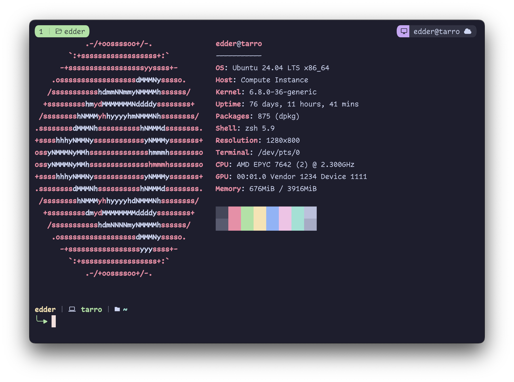

# hostname-tmux: Hostname, user and ssh detection package for tmux

Displays hostname, detects if user is root and when is remote (SSH) will display an icon.

Mainly Made for [Catpuccin Tmux Theme](https://github.com/catppuccin/tmux).



## Requirements

- Tmux
- Homebrew
- Patched NerdFont

## Installation

### TPM

Add _hostname-tmux_ plugin in your `.tmux.conf` file

```bash
set -g @plugin 'edderrd/hostname-tmux'
```

### Catpuccin Component (Optional)

**Note:** Ensure you have [Catpuccin Tmux Plugin](https://github.com/catppuccin/tmux) installed

Copy file _component_ file

```bash
cp catpuccin/hostname.sh ${TMUX_PLUGIN_MANAGER_PATH}/tmux/custom/
```

Then you can use in you `.tmux.conf` by setting

```bash
set -g @catppuccin_status_modules_right "... hostname ..."
```

#### Configurations

Set root icon:

```bash
set -g "@catppuccin_brew_root_icon"
```

Set ssh icon:

```bash
set -g "@catppuccin_brew_ssh_icon"
```
